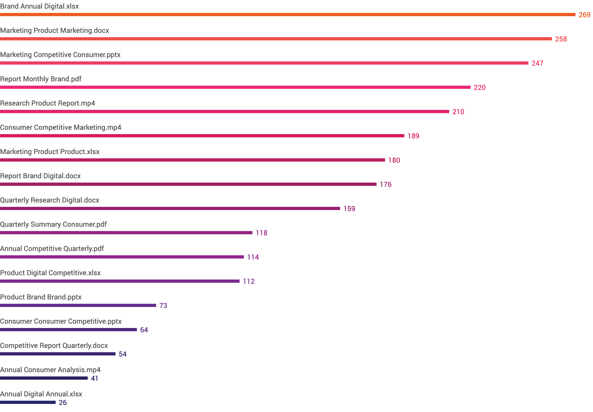
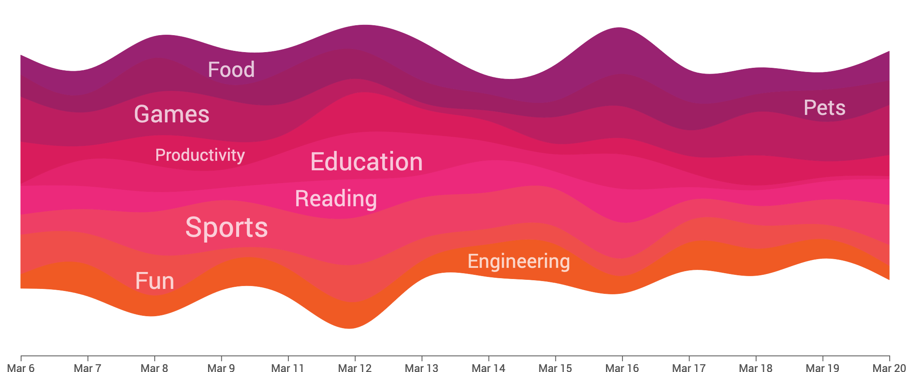

# sharpr-bi-report-graphs

Functions to render graphs with d3

[Demo](https://kensnyder.github.io/sharpr-bi-report-graphs/)

## barHorizontal()

```js
import { barHorizontal } from 'sharpr-bi-report-graphs';

barHorizontal({
  width,                   // The width of the chart
  data,                    // An array of objects with props value, label
  links,                   // An array of objects with props text, onClick(dataPoint)
  onClick,                 // A function to run when you click on a bar (arg1=dataPoint)
  withinElement,           // An Element or selector to an element
  linkColor = '#EE5834',   // The color to use for link text
  minSpacing = 45,         // Minimum vertical spacing between bars
  maxSpacing = 55,         // Maximum vertical spacing between bars
  maxHeight = 550,         // Max graph height (overridden by minSpacing)
  animationDuration = 500, // MS over which to animate bar growth
  animationOffset = 40,    // MS delay between each bar animation
});
```



## barVertical()

```js
import { barVertical } from 'sharpr-bi-report-graphs';

barVertical({
  data,                    // An array of objects with props value, label
  color,                   // Color of each bar
  height,                  // Graph height
  width,                   // Graph width
  onClick,                 // A function to run when you click on a bar (arg1=dataPoint)
  withinElement,           // An Element or selector to an element
  animationDuration = 500, // MS over which to animate bar growth
  animationOffset = 40,    // MS delay between each bar animation
});
```


## bubbles()

```js
import { bubbles } from 'sharpr-bi-report-graphs';

bubbles({
  data,                    // An array of objects with props value, label
  width,                   // The width and height of the chart
  onClick,                 // A function to run when you click on a bubble (arg1=dataPoint)
  withinElement,           // An Element or selector to an element
  animationDuration = 500, // MS over which to animate bubble growth
  animationOffset = 40,    // MS delay between each bubble animation
});
```


## stream()

[What is a stream chart?](https://datavizcatalogue.com/methods/stream_graph.html) |
[Scientific paper](http://leebyron.com/streamgraph/)

```js
import { stream } from 'sharpr-bi-report-graphs';

stream({
  series,                  // Data in the format outlined below
  width,                   // The width of the chart
  height,                  // The height of the chart
  withinElement,           // An Element or selector to an element
  animationDuration = 500, // MS over which to animate area growth
  animationOffset = 40,    // MS delay between each area animation
});
```



**stream `series` format**

Example data:

```js
const series = {
  dates: ['Mar 1', 'Mar 2', 'Mar 3', 'Mar 3'],
  items: [
    {
      label: 'Series 1',
      values: [1, 8, 3, 10]
    },
    {
      label: 'Series 2',
      values: [11, 6, 2, 0]
    },
    {
      label: 'Series 3',
      values: [7, 12, 18, 22]
    }
  ]
};
```
